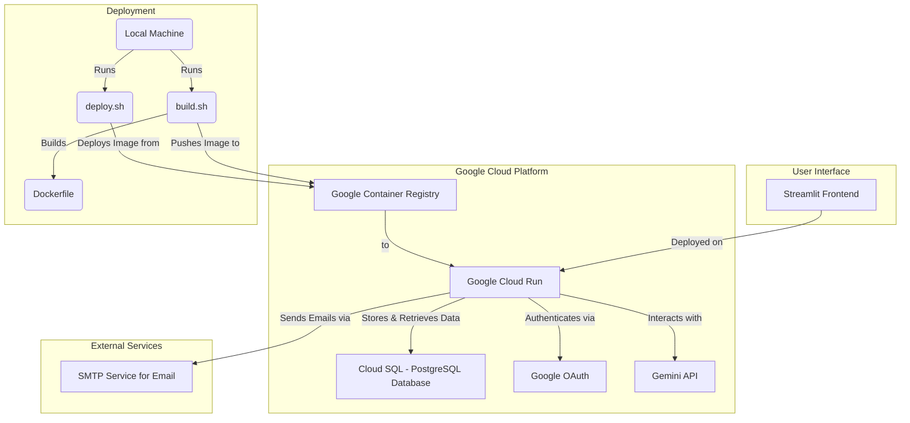

# AI-enabled Life Tracker

This project is a sophisticated, multimodal AI chat application using Google's Gemini model, deployed as a scalable web service on Google Cloud. It allows users to interact with the AI through both text and audio, log their activities, manage tasks, and receive personalized insights, all while ensuring data privacy and persistence through a secure, cloud-based architecture.

## Features

-   **Multimodal Chat:** Engage in text-based and audio conversations with the Gemini model.
-   **Cloud-Native Architecture:** Fully deployed on Google Cloud, using **Cloud Run** for scalable, serverless application hosting and **Cloud SQL** (PostgreSQL) for robust, persistent data storage.
-   **Secure User Authentication:** Integrates **Google OAuth** for secure sign-in, ensuring that all user data is protected and tied to their account.
-   **User Consent & Privacy:** Implements a mandatory **consent layer** on first visit. Users must accept the terms before using the app. Includes dedicated **Privacy Policy** and **Imprint** pages.
-   **Persistent, Structured Data:** All user data (logs, tasks, background info, etc.) is stored securely in a **Cloud SQL database**, defined by a clear **SQLAlchemy ORM schema**. This replaces the previous local file-based storage.
-   **Intelligent Function Calling:** The Gemini model intelligently calls backend functions to:
    *   Log user input to the database.
    *   Update user background information.
    *   Manage tasks (add, update, list).
-   **Comprehensive Data Management:**
    *   **Input Log:** A complete history of user inputs, fully editable in the UI.
    *   **Task Management:** A dedicated tab to view, add, delete, and edit tasks. Tasks can also be managed via chat.
    -   **Background Info:** A JSON-based view for providing and updating personal context (goals, values, etc.) to tailor AI responses.
-   **Automated Newsletter "Nudge Engine":** A "Newsletter" tab allows users to trigger a personalized email newsletter that provides insights and "nudges" based on their recent activity & selected persona.
-   **Newsletter Personas:** Users can choose from different AI personas to tailor the tone and focus of their newsletter:
    -   **The Pragmatist (General Alistair Finch):** Embodies a field general's mindset, viewing life as a series of campaigns. This persona delivers a direct, authoritative "Commander's Briefing" focused on momentum, decisive action, and strategic execution. It's ideal for users who want to cut through ambiguity and receive clear, actionable orders to conquer their goals.
    -   **The Analyst (Dr. Aris Thorne):** A systems engineer who sees life as an interconnected set of algorithms and feedback loops. This persona provides a data-driven, "Systems Analysis" of your activity, drawing parallels to economic theories and computational logic. It's perfect for users who want to understand the "why" behind their behavior and identify systemic inefficiencies.
    -   **The Catalyst (Dr. Elara Vance):** A visionary who blends art and science to spark transformation. This persona offers a creative, gentle, and motivational perspective, encouraging "life experiments" to break patterns and uncover new possibilities. It's suited for users seeking to challenge their assumptions and explore new ideas.
-   **Streamlined Deployment:** The entire application is containerized with Docker and deployed to Cloud Run using unified `build.sh` and `deploy.sh` scripts that handle both **production** and **development** environments.

## Architecture Diagram



## Prerequisites

-   **Google Cloud Project:** A GCP project with the Cloud Run, Cloud SQL, and Artifact Registry APIs enabled.
-   **Google GenAI API Key:** Obtain a free API key from [Google AI Studio](https://aistudio.google.com/apikey).
-   **Python 3.12:** Ensure you have Python 3.12 installed on your system.
-   **Docker:** Docker installed and running locally to build the container image.
-   **gcloud CLI:** The Google Cloud CLI installed and authenticated.

## Installation & Deployment

This application is designed for deployment on Google Cloud. Local execution is possible but requires a running Cloud SQL proxy or local PostgreSQL instance configured to match the models.

1.  **Clone the repository:**
    ```bash
    git clone <repository-url>
    cd gemini_multimodal_demo
    ```

2.  **Set up Environment Files:**
    This application uses separate configuration files for production and development environments.

    -   **Production (`.env` & `secrets.toml`):**
        -   Copy `.env.example` to `.env`.
        -   Copy `.streamlit/secrets.toml.example` to `.streamlit/secrets.toml`.
        -   Fill in all the required values in both files for your **production** GCP project, Cloud SQL instance, and other credentials.

    -   **Development (`.env.dev` & `secrets.dev.toml`):**
        -   Copy `.env.example` to `.env.dev`.
        -   Copy `.streamlit/secrets.dev.toml.example` to `.streamlit/secrets.dev.toml`.
        -   Fill in all the required values for your **development** environment.

3.  **Build and Push the Docker Image:**
    -   The `build.sh` script builds the Docker image and pushes it to your project's Google Container Registry. It automatically includes the correct Streamlit secrets file based on the environment.
    -   **For Production:**
        ```bash
        ./build.sh
        ```
    -   **For Development:**
        ```bash
        ./build.sh --dev
        ```

4.  **Deploy to Cloud Run:**
    -   The `deploy.sh` script deploys the container image from GCR to Cloud Run, configuring all necessary environment variables from the correct `.env` file.
    -   **For Production (will ask for confirmation):**
        ```bash
        ./deploy.sh
        ```
    -   **For Development (deploys without confirmation):**
        ```bash
        ./deploy.sh --dev
        ```
    -   The script will output the URL of your deployed service.

## Usage

-   **Access the Application:** Open the URL provided by the `deploy.sh` script in your web browser.
-   **First Visit:**
    -   You will be presented with a **consent banner**. Review the details and click "Accept" to proceed.
    -   You will then be prompted to **Sign in with Google**.
-   **Interacting with the App:**
    -   **Chat Tab:** Use text or audio to interact with the AI. The AI can log your inputs, manage tasks, and update your background info automatically.
    -   **Input Log, Tasks, Background Info Tabs:** Directly view, edit, and manage your data. All changes are saved to the Cloud SQL database.
    -   **Newsletter Tab:** Manually trigger a personalized newsletter to be sent to your email.

## Legal

This application requires you to set up your own legal documents. Example templates are provided:
-   **`privacy_policy.md.example`**: A template for the privacy policy. Copy this to `privacy_policy.md` and fill in your details.
-   **`imprint.md.example`**: A template for the imprint/legal notice. Copy this to `imprint.md` and fill in your details.

These files are not tracked by git to ensure you do not accidentally commit personal information.

## Code Overview

-   **`app.py`:** The main Streamlit application. Handles UI, state management, user authentication flow, and the consent layer.
-   **`utils.py`:** Contains the core business logic, including:
    -   Interaction with the Gemini API (`get_chat_response`).
    -   Function calling definitions and implementation logic (`*_impl` functions).
    -   Database interaction functions for loading and saving data.
-   **`database.py`:** Configures the connection to the **Google Cloud SQL** database using the Cloud SQL Connector and SQLAlchemy.
-   **`models.py`:** Defines the database schema using **SQLAlchemy ORM**, with tables for `User`, `TextInput`, `Task`, `BackgroundInfo`, and `NewsletterLog`.
-   **`newsletter.py`:** Logic for generating and sending personalized email newsletters using an SMTP service.
-   **`build.sh`:** Script to build the application's Docker image and push it to Google Container Registry. Handles both `prod` and `dev` environments (`--dev` flag).
-   **`deploy.sh`:** Script to deploy the Docker image to **Google Cloud Run**. Handles both `prod` and `dev` environments (`--dev` flag).
-   **`.env.example`, `.env.dev`:** Templates and files for environment variables (GCP settings, database connections, etc.).
-   **`.streamlit/secrets.toml.example`, `.streamlit/secrets.dev.toml`:** Templates and files for Streamlit secrets (API keys, OAuth credentials).
-   **`Dockerfile`:** Defines the container image for the application.

## LLM Interaction and Function Calling

The intelligence of this application lies in how the Gemini model interprets user input and interacts with the application's backend through a sophisticated function-calling mechanism.

### System Prompt & Context

On every interaction, the LLM is provided with a detailed system prompt that includes:
-   **Current Time and Date:** To provide timely and relevant responses.
-   **User's Background Information:** A JSON object of the user's goals, values, and preferences.
-   **Recent Log Entries:** A summary of the user's last five log entries to understand recent context.
-   **Current Tasks:** A list of all open and in-progress tasks.
-   **Function Definitions:** A schema of all available tools the model can use.

This rich context allows the model to make informed decisions rather than just responding to the immediate user prompt.

### Available Functions

The model has access to a set of tools (functions) that it can call to perform actions within the application. The decision to call one or more functions is made by the LLM based on the user's intent.

1.  **`add_log_entry`**:
    -   **Purpose:** To record a user's thoughts, observations, or general statements.
    -   **Trigger:** Called whenever the user provides a statement that should be logged for future reference. It's designed to capture the "what" and "why" of a user's day.
    -   **Example:** User says, "I'm feeling motivated after my morning run." -> The model calls `add_log_entry` to save this sentiment.

2.  **`update_background_info`**:
    -   **Purpose:** To update the user's core profile, including their goals, values, challenges, and habits.
    -   **Trigger:** Called when the user explicitly states a new goal, a change in values, or provides any new personal context. The model extracts the relevant information and structures it into the required JSON format.
    -   **Example:** User says, "I want to start learning Spanish." -> The model calls `update_background_info` with a JSON object to add "Learn Spanish" to the user's goals.

3.  **`manage_tasks`**:
    -   **Purpose:** A comprehensive tool to add, update, or list tasks.
    -   **Triggers:**
        -   `action='add'`: When the user expresses a concrete, actionable intent (e.g., "I need to send the report by 5 PM."). The model also infers deadlines from natural language.
        -   `action='update'`: When the user indicates progress or completion of a task (e.g., "I just finished the presentation slides.").
        -   `action='list'`: When the user asks to see their current tasks.

### Multi-Function Calling

The system is designed to handle complex inputs by calling multiple functions in a single turn. This allows for more efficient and natural interactions.

-   **Example:** User says, "Finished my workout, and I've decided my main goal this month is to improve my diet."
-   **LLM Action:**
    1.  Calls `manage_tasks` to mark the "workout" task as complete.
    2.  Calls `update_background_info` to add "Improve my diet" to the user's goals.
    3.  Calls `add_log_entry` to record the user's statement and the decision made.

This intelligent, multi-faceted approach allows the application to act as a true assistant, seamlessly integrating user conversation into structured, actionable data.

## Notes

-   The audio recording functionality uses the `audiorecorder` library within Streamlit.
-   Temporary audio files are created and deleted during audio processing.
-   Conversation history, input logs, and background information are stored in the Streamlit session state.
-   The Docker image uses a slim Python base image and installs `ffmpeg` for audio processing.

## Limitations

-   This is a demo and may not handle all edge cases or complex conversation scenarios.
-   The audio processing is limited to `.wav` files.
-   Error handling is minimal.
-   The LLM's ability to perfectly categorize logs or structure background information from free text is dependent on the model's capabilities and the clarity of user input.

## Future Enhancements

-   Improve error handling and robustness.
-   Support additional audio formats.
-   Implement more sophisticated conversation management.
-   Expand function calling capabilities with more tools.

## Contributing

Contributions are welcome! Please feel free to submit issues or pull requests.

## License

This project is licensed under the MIT License - see the `LICENSE` file for details.
